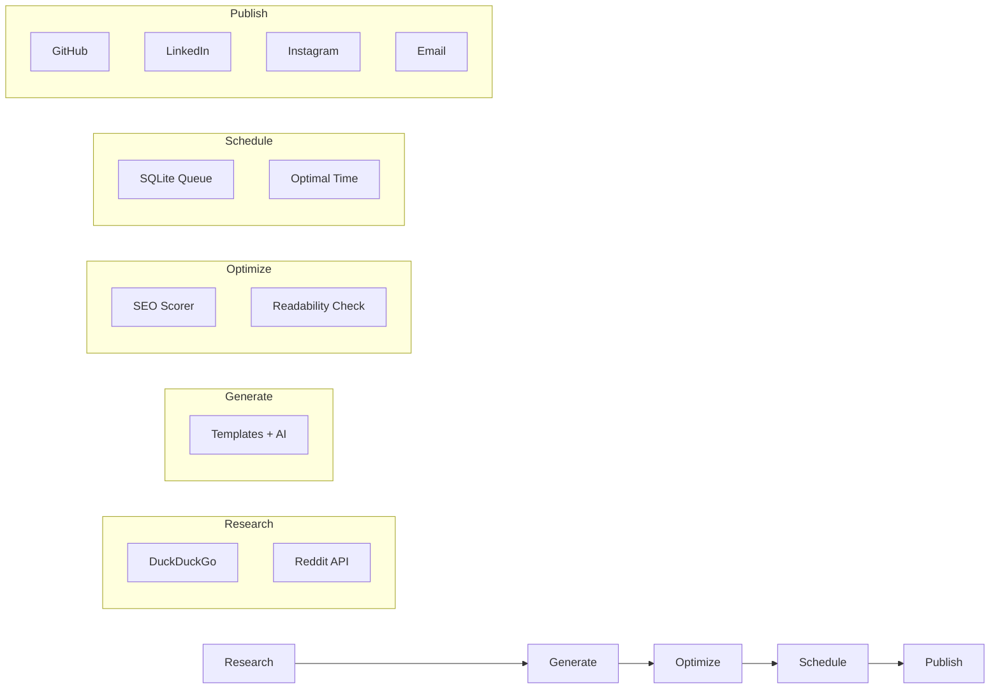
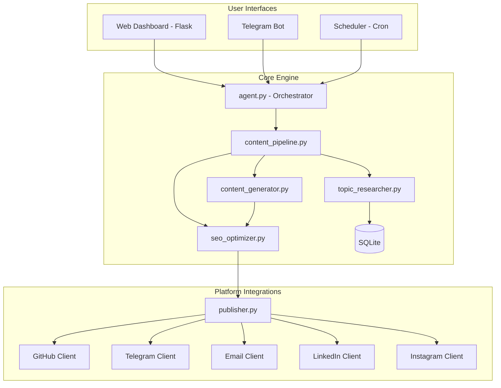
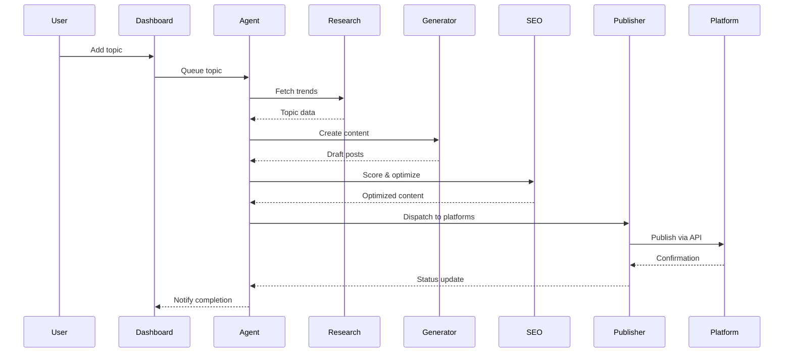

<div align="center">

# content-agent

**Autonomous AI Content Agent for Termux**

SEO-optimized content generation, multi-platform publishing, dashboard monitoring, and Telegram integration — all running on your phone.

[](https://python.org)
[](https://termux.dev)
[](LICENSE)
[](https://github.com/ykrishhh/content-agent)

</div>

---

I got tired of manually writing posts for GitHub, LinkedIn, and Instagram every week. So I built this — an autonomous agent that researches topics, generates SEO-optimized content, and publishes across platforms. All from a Termux session on my phone.

## What It Does

```
Research Topic → Generate Content → Optimize SEO → Schedule → Publish
     ↓                ↓                  ↓              ↓           ↓
  DuckDuckGo     Templates + AI     Keyword score    SQLite     GitHub/LinkedIn/
  Reddit API     Multi-platform     Readability      Scheduler  Instagram/Email
```

- **Topic Research** — Scrapes DuckDuckGo and Reddit for trending topics in your niche
- **Content Generation** — Creates blog posts, LinkedIn articles, Instagram captions, email newsletters
- **SEO Optimization** — Scores content on keyword density, readability, meta tags, heading structure
- **Multi-Platform Publishing** — Pushes to GitHub (blog posts), LinkedIn, Instagram, Email
- **Web Dashboard** — Dark-theme Flask UI to manage topics, view calendar, track analytics
- **Telegram Bot** — Add topics, trigger generation, check status from your phone
- **Scheduler** — Auto-publishes scheduled content, retries failed posts

## Quick Start

```bash
# Clone the repo
git clone https://github.com/ykrishhh/content-agent.git
cd content-agent

# Install dependencies
pip install -r requirements.txt

# Copy and edit config
cp config.json config.local.json
# Edit config.local.json with your API keys

# Run everything
python main.py

# Or run specific components
python main.py --dashboard    # Web UI only
python main.py --bot          # Telegram bot only
python main.py --scheduler    # Background scheduler only
```

## Architecture

```
content-agent/
├── core/                    # Brain of the system
│   ├── agent.py            # Main ContentAgent orchestrator
│   ├── content_pipeline.py # Research → Generate → Optimize → Schedule
│   ├── content_generator.py # Multi-platform content templates
│   ├── seo_optimizer.py    # Keyword scoring, readability analysis
│   ├── topic_researcher.py # DuckDuckGo + Reddit trend scraping
│   ├── models.py           # Data models (Topic, Post, Platform)
│   └── db.py               # SQLite persistence
├── platforms/               # Platform integrations
│   ├── github_client.py    # GitHub via gh CLI
│   ├── telegram_client.py  # Telegram Bot API
│   ├── email_client.py     # SMTP newsletter sender
│   ├── linkedin_client.py  # LinkedIn API (OAuth)
│   ├── instagram_client.py # Instagram Graph API
│   └── publisher.py        # Multi-platform orchestrator
├── dashboard/               # Web UI
│   ├── app.py              # Flask routes
│   ├── templates/          # HTML templates (dark theme)
│   └── static/             # CSS
├── telegram_bot/            # Telegram interface
│   └── bot.py              # Bot commands and handlers
├── scheduler/               # Background automation
│   └── cron.py             # Post scheduler with retries
├── config/                  # Configuration
│   ├── settings.py         # Settings loader
│   └── .env.example        # Environment variables template
├── main.py                  # Entry point
├── config.json              # Default configuration
└── requirements.txt         # Dependencies
```

### Content Pipeline Flow



### System Architecture



### Data Flow Diagram



## Dashboard

The web dashboard gives you a full overview:

- **Home** — Stats cards, recent activity, quick actions
- **Topics** — Manage your topic queue, add new ideas
- **Posts** — Content calendar view, scheduled vs published
- **Analytics** — Track performance across platforms
- **Settings** — Configure API keys, scheduling, SEO targets

```bash
# Access at http://localhost:5000
python main.py --dashboard
```

## Telegram Bot Commands

| Command | What It Does |
|---------|-------------|
| `/start` | Welcome message and setup |
| `/add_topic [topic]` | Add a topic to the research queue |
| `/list_topics` | Show all pending topics |
| `/generate [topic_id]` | Generate content for a specific topic |
| `/status` | Show agent status and upcoming posts |
| `/schedule` | View scheduled content |
| `/help` | Show all commands |

## Configuration

Edit `config.json` or set environment variables:

```json
{
  "github": { "enabled": true, "username": "ykrishhh" },
  "telegram": { "enabled": true, "bot_token": "YOUR_TOKEN", "chat_id": "YOUR_CHAT_ID" },
  "email": { "enabled": true, "smtp_host": "smtp.gmail.com", "username": "you@gmail.com", "password": "app-password" },
  "scheduler": { "enabled": true, "check_interval_minutes": 30 },
  "seo": { "target_keyword_density": 2.5, "min_readability_score": 60 }
}
```

## How Content Gets Generated

1. **Research** — Agent scrapes DuckDuckGo and Reddit for trending topics in your niche
2. **Angle Selection** — Picks the best angle based on competition and search volume
3. **Draft** — Generates content using templates with topic-specific variables
4. **SEO Pass** — Scores readability, keyword density, heading structure. Rewrites if below threshold.
5. **Format** — Adapts to each platform (blog post → LinkedIn article → Instagram caption)
6. **Schedule** — Queues for optimal posting time
7. **Publish** — Pushes to enabled platforms via their APIs/CLIs
8. **Track** — Logs analytics for performance monitoring

## Platform Status

| Platform | Status | Auth Method |
|----------|--------|------------|
| GitHub | Working | `gh auth login` |
| Telegram | Working | Bot token from @BotFather |
| Email | Working | SMTP (Gmail app password) |
| LinkedIn | Ready | OAuth 2.0 (needs app registration) |
| Instagram | Ready | Graph API (needs business account) |

## Built For Termux

Everything runs on Android via Termux. No server needed. No Docker. Just Python, your phone, and an internet connection.

```bash
# Install on Termux
pkg install python git
pip install -r requirements.txt
```

## Contributing

Contributions welcome. Open an issue or submit a PR.

## License

MIT License — see [LICENSE](LICENSE) for details.

---

<div align="center">

Built by [ykrishhh](https://github.com/ykrishhh) · Security Researcher & Developer

*Stop writing posts manually. Let the agent handle it.*

</div>

<!-- SEO Keywords: content-agent, ai-content, termux, seo-optimization, content-automation, github-bot, telegram-bot, content-pipeline, social-media-automation, developer-tools -->
